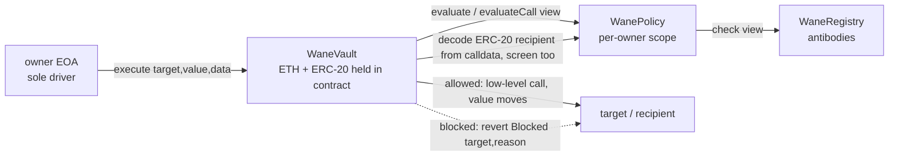

# Wane Vault

<p align="center">
  <a href="https://github.com/WaneProtocol/wane-vault/blob/main/LICENSE"></a>
  <a href="https://github.com/WaneProtocol/wane-vault/actions/workflows/ci.yml"></a>
  <a href="https://github.com/WaneProtocol/wane-vault/commits/main"></a>
  <a href="https://github.com/WaneProtocol/wane-vault/stargazers"></a>
</p>

<p align="center">
  <a href="https://wane.network"></a>
  <a href="https://x.com/wanedotnetwork"></a>
  <a href="https://basescan.org/address/0x6640dd13F172c356f671d35ef76695792908e2a9"></a>
  <a href="https://book.getfoundry.sh"></a>
</p>

**WaneVault** is a non-custodial screening smart wallet on EVM. Funds (ETH and ERC-20) live inside the vault. Only the owner drives it, and every outbound action routed through `execute()` is screened against the owner's `WanePolicy` (plus the shared antibody registry the policy reads) before any value moves. A flagged target reverts before the transfer. The contract can only block, never divert: the sole exits are `execute()` (screened) and `withdraw()` (owner-only, back to the owner), so deposits are never trapped.

This is the EVM counterpart of the Solana Wane session vault. It is stronger than a 7702 delegate guard: a 7702 guard only runs when the wallet routes a call through `execute()`, so a raw key-signed transaction bypasses it. Funds held in this vault have no such bypass.

## Features

| Feature | Status |
|---|---|
| Vault: ETH + ERC-20 held in contract, owner-driven | stable |
| Screen every outbound action against owner WanePolicy | stable |
| Decode + screen the REAL ERC-20 recipient from calldata | stable |
| Batch execute, atomic revert on any flagged action | stable |
| Owner withdraw (funds never trapped) | stable |
| `wouldAllow` free dry-run of the screen | stable |
| CREATE2 factory: predict + create per-owner vault | stable |
| TypeScript SDK (`@wane/vault-sdk`, viem) | stable |
| Base mainnet factory deploy | live |

## Architecture



The factory deploys one `WaneVault` per owner at a deterministic CREATE2 address, so a client can compute and fund the vault before it exists. See [`docs/architecture.md`](./docs/architecture.md) for the full data flow and [`docs/threat-model.md`](./docs/threat-model.md) for the guarantees.

## Build

```bash
# 1. clone with submodules (forge-std + openzeppelin-contracts are pinned)
git clone --recurse-submodules https://github.com/WaneProtocol/wane-vault
cd wane-vault

# if you cloned without --recurse-submodules:
git submodule update --init --recursive

# 2. build + test the contracts
forge build
forge test

# 3. TypeScript SDK
cd sdk && npm install && npm run build && cd ..
```

Required tooling:
- [Foundry](https://book.getfoundry.sh) (forge, cast) on a recent nightly
- Solidity 0.8.27 (pinned in `foundry.toml`, no auto-detect)
- Node.js 20+ for the SDK and examples

## Quick start

Create a vault, fund it, then send through the screen with the SDK:

```ts
import { createPublicClient, createWalletClient, http, parseEther } from "viem";
import { privateKeyToAccount } from "viem/accounts";
import { base } from "viem/chains";
import { WaneVaultClient } from "@wane/vault-sdk";

const account = privateKeyToAccount(process.env.PRIVATE_KEY as `0x${string}`);
const publicClient = createPublicClient({ chain: base, transport: http() });
const walletClient = createWalletClient({ account, chain: base, transport: http() });

const wane = new WaneVaultClient({ publicClient, walletClient });

// 1. compute the vault address before it exists, then create it
const vault = await wane.predictVault(account.address);   // 0x... deterministic CREATE2 address
await wane.createVault();                                  // 0x<txhash>, deploys at `vault`

// (fund `vault` with ETH / ERC-20 by sending to that address)

// 2. send ETH through the screen; a flagged recipient reverts before value moves
await wane.send(vault, "0xRecipient...", parseEther("0.1")); // 0x<txhash> on allow, revert Blocked on flag

// 3. free dry-run, no gas
const check = await wane.wouldAllow(vault, "0xRecipient...", parseEther("0.1"));
// { allowed: true, reason: 0, label: "ok" }  |  { allowed: false, reason: 2, label: "antibody match" }

// 4. withdraw back to the owner (unscreened, funds never trapped)
await wane.withdrawETH(vault, parseEther("0.05"));         // 0x<txhash>
```

Send an ERC-20 (the real recipient is decoded and screened on-chain):

```ts
// a transfer to a flagged address reverts even though the call target is the token
await wane.sendToken(vault, "0xToken...", "0xRecipient...", 100_000000n); // 0x<txhash> | revert Blocked
```

Drive the vault directly from cast:

```bash
# predict + create
cast call   0x6640dd13F172c356f671d35ef76695792908e2a9 "predict(address)(address)" $OWNER --rpc-url base
cast send   0x6640dd13F172c356f671d35ef76695792908e2a9 "createVault()(address)" --rpc-url base --private-key $PK

# screened send from the vault
cast send   $VAULT "execute(address,uint256,bytes)" $TO 100000000000000000 0x --rpc-url base --private-key $PK
```

## Deployments

These are real and verifiable on-chain. The factory mints per-owner vaults that reuse the already-live policy and antibody registry, so no new economy or genesis is involved.

| Contract | Address | Explorer |
|---|---|---|
| WaneVaultFactory | `0x6640dd13F172c356f671d35ef76695792908e2a9` | [BaseScan](https://basescan.org/address/0x6640dd13F172c356f671d35ef76695792908e2a9) |
| WanePolicy (reused) | `0x26deE4503C7f67356837ED41cE285026EF256667` | [BaseScan](https://basescan.org/address/0x26deE4503C7f67356837ED41cE285026EF256667) |
| WaneRegistry (reused) | `0x027F371fB139A57EcD2A2E175d30157eEA1C56de` | [BaseScan](https://basescan.org/address/0x027F371fB139A57EcD2A2E175d30157eEA1C56de) |

Network: Base mainnet (chain `8453`).

## Project structure

```
wane-vault/
├── foundry.toml                 src/test/script, solc 0.8.27, via_ir, cancun
├── remappings.txt               forge-std/ and @openzeppelin/
├── .gitmodules                  pinned forge-std + openzeppelin-contracts
├── src/
│   ├── WaneVault.sol            held funds, owner-driven, screened execute()
│   ├── WaneVaultFactory.sol     CREATE2 per-owner factory (predict / create)
│   ├── IWanePolicy.sol          the policy view surface the vault calls
│   ├── WanePolicy.sol           per-owner protection scope + reason codes
│   ├── WaneRegistry.sol         antibody registry the policy reads
│   ├── WaneToken.sol            $WANE (stake / reward currency)
│   └── WaneTypes.sol            shared threat / antibody types
├── test/WaneVault.t.sol         clean pass, ETH + ERC-20 drainer block, withdraw, onlyOwner, batch, predict
├── script/DeployVaultFactory.s.sol  deploy wired to the live policy
├── sdk/                         TypeScript SDK (@wane/vault-sdk, viem)
├── examples/                    create-and-send, screened-token-send
├── docs/                        architecture, threat-model, sdk
└── lib/                         submodules (gitignored, pinned via .gitmodules)
```
