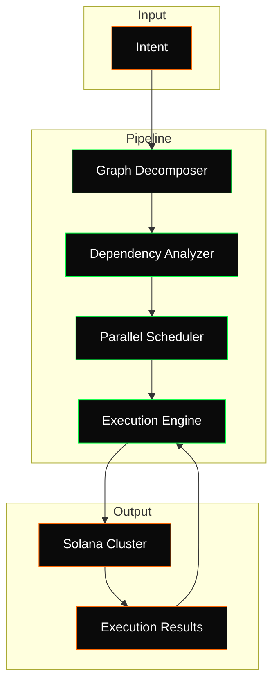
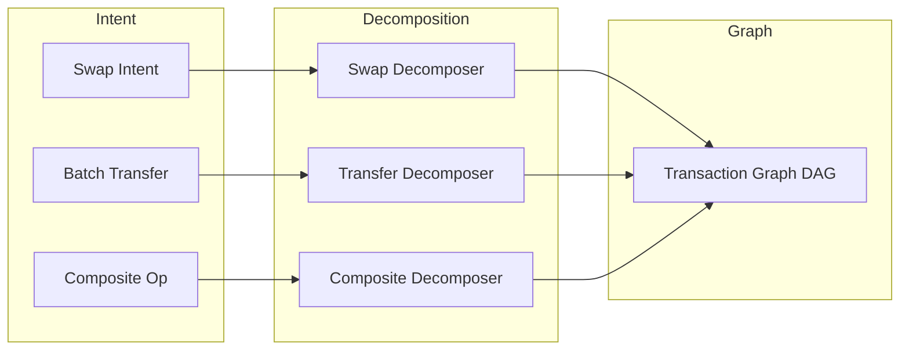
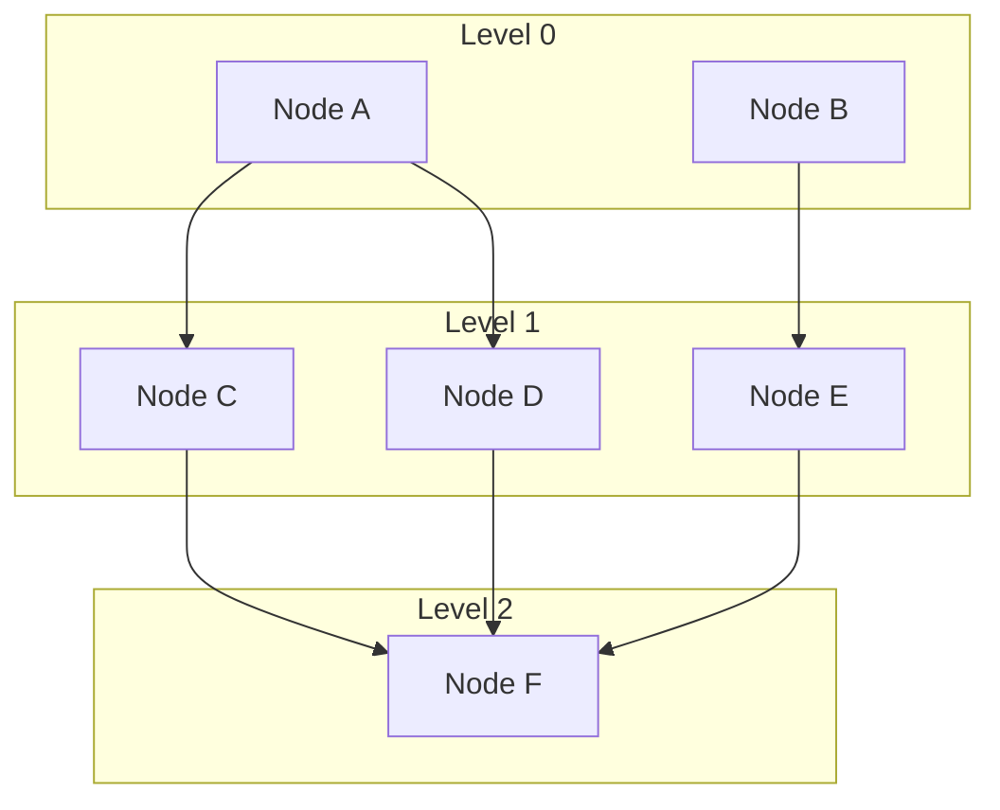

# IVZA Architecture

This document describes the internal architecture of the IVZA Execution Layer, covering the pipeline stages, data flow, algorithms, and design decisions.

---

## Overview

IVZA transforms high-level transaction intents into optimized parallel execution plans for Solana. The system is structured as a five-stage pipeline where each stage performs a discrete transformation on the workload.



---

## Stage 1: Intent Parsing

The intent parser accepts user-defined operations and normalizes them into a structured intermediate representation. Supported intent types:

- **Swap**: Single token swap with input/output mints, amount, and slippage.
- **BatchTransfer**: Multiple token transfers to different destinations.
- **CompositeOperation**: A sequence of sub-intents that may be atomic or non-atomic.
- **ProgramInvocation**: Direct program call with accounts and instruction data.

Intent parsing validates inputs, resolves token accounts, and prepares metadata required by the graph decomposer.

---

## Stage 2: Graph Decomposition

The graph decomposer converts a parsed intent into a transaction graph (DAG). Each intent type has a dedicated decomposition strategy.



### Swap Decomposition

A swap intent is decomposed into:

1. A route discovery step that queries available liquidity pools.
2. One or more instruction nodes representing the swap path (direct or multi-hop).
3. Edges encoding the sequential dependency of multi-hop routes.

For a direct swap, this produces a single node. For a multi-hop route (A -> B -> C), this produces two nodes with a data dependency edge.

### Batch Transfer Decomposition

Batch transfers produce one node per transfer. Since transfers to different accounts have no shared write sets, they are typically fully independent, yielding maximum parallelism.

### Composite Decomposition

Composite operations recursively decompose each sub-intent and merge the resulting sub-graphs. If `atomic` is true, a barrier edge is added between all sub-graphs to enforce sequential execution within a single transaction where possible.

---

## Stage 3: Dependency Analysis

The dependency analyzer computes account-level conflicts between all pairs of nodes in the graph.

### Conflict Detection Algorithm

For each pair of nodes (i, j), a conflict exists if:

- `write_set(i)` intersects `write_set(j)` (write-write conflict)
- `write_set(i)` intersects `read_set(j)` (write-read conflict)
- `read_set(i)` intersects `write_set(j)` (read-write conflict)

Read-read access is not a conflict and does not create a dependency.

### Conflict Matrix

The output is an n x n boolean matrix where `matrix[i][j] = true` indicates that nodes i and j cannot execute concurrently. This matrix, combined with the explicit edges from graph decomposition, defines the complete dependency structure.

```
        Node_A  Node_B  Node_C  Node_D
Node_A    --    false   true    false
Node_B  false     --    false   true
Node_C  true    false     --    false
Node_D  false   true    false     --
```

In this example, (A, C) and (B, D) conflict, but (A, B), (A, D), (B, C), and (C, D) are independent.

### Complexity

The analysis runs in O(n^2 * k) where n is the node count and k is the average account set size. For typical DeFi operations with 5-20 nodes and 2-5 accounts per node, this completes in microseconds.

---

## Stage 4: Parallel Scheduling

The scheduler assigns nodes to parallel lanes using a modified topological sort with level assignment.

### Algorithm

1. Compute the in-degree of every node considering both explicit edges and conflict-derived edges.
2. Assign all zero-in-degree nodes to level 0.
3. For each subsequent level, remove the previous level's nodes, recompute in-degrees, and assign new zero-in-degree nodes.
4. Within each level, distribute nodes across lanes using a round-robin or load-balancing strategy.
5. Cap the number of concurrent lanes at `max_parallelism`.



In this graph, nodes A and B execute in parallel at level 0. Once both complete, nodes C, D, and E execute in parallel at level 1. Node F waits for all level 1 nodes before executing at level 2.

### Lane Assignment

Within a level, nodes are assigned to lanes to balance execution time. The scheduler estimates per-node execution time based on instruction complexity and historical data. Nodes are assigned to the lane with the least total estimated time.

### Barrier Synchronization

Between levels, the engine inserts a barrier. All nodes in level N must confirm before any node in level N+1 begins execution. This ensures correctness while maximizing intra-level parallelism.

---

## Stage 5: Execution Engine

The execution engine dispatches transactions to Solana and manages confirmations, retries, and error handling.

### Dispatch Modes

- **RPC Mode**: Transactions are submitted via `sendTransaction` RPC calls. Suitable for most workloads.
- **TPU Mode**: Transactions are sent directly to the leader's TPU port for lower latency. Requires UDP connectivity to the validator.

### Confirmation

Each transaction is confirmed according to the configured commitment level (`processed`, `confirmed`, or `finalized`). The engine uses WebSocket subscriptions for real-time confirmation when available, falling back to polling.

### Retry Logic

Failed transactions are retried up to `retry_attempts` times with exponential backoff. Specific error codes trigger different strategies:

- **Blockhash expired**: Refresh blockhash and resubmit.
- **Insufficient funds**: Abort the node and propagate failure.
- **Account already in use**: Backoff and retry (contention).
- **Program error**: Abort and invoke the compensation path if defined.

### Error Propagation

When a node fails permanently, the scheduler evaluates which downstream nodes are affected. Nodes that transitively depend on the failed node are cancelled. Independent branches continue execution.

---

## Data Flow Summary

```
Intent (user input)
    |
    v
TransactionGraph (DAG of TxNode + Edge)
    |
    v
DependencyAnalysis (conflict matrix + merged edges)
    |
    v
ExecutionSchedule (levels -> lanes -> ordered nodes)
    |
    v
ExecutionResults (per-node signature + status)
```

---

## Design Decisions

### Why DAGs Over Transaction Batches

Batching transactions is the simplest form of parallelism but ignores dependency structure. By modeling the workload as a DAG, IVZA can extract parallelism from complex multi-step operations where some steps are independent and others are not.

### Why Account-Level Conflict Detection

Solana's runtime uses account-level locking. Two transactions that touch the same writable account cannot execute in the same slot without contention. By mirroring this model, IVZA's scheduler produces execution plans that align with Solana's native parallelism.

### Why Level-Based Scheduling

Level-based scheduling (as opposed to greedy or priority-based) provides deterministic execution ordering and simplifies barrier synchronization. Each level represents a wavefront of independent operations, matching the natural structure of most DeFi workflows.
